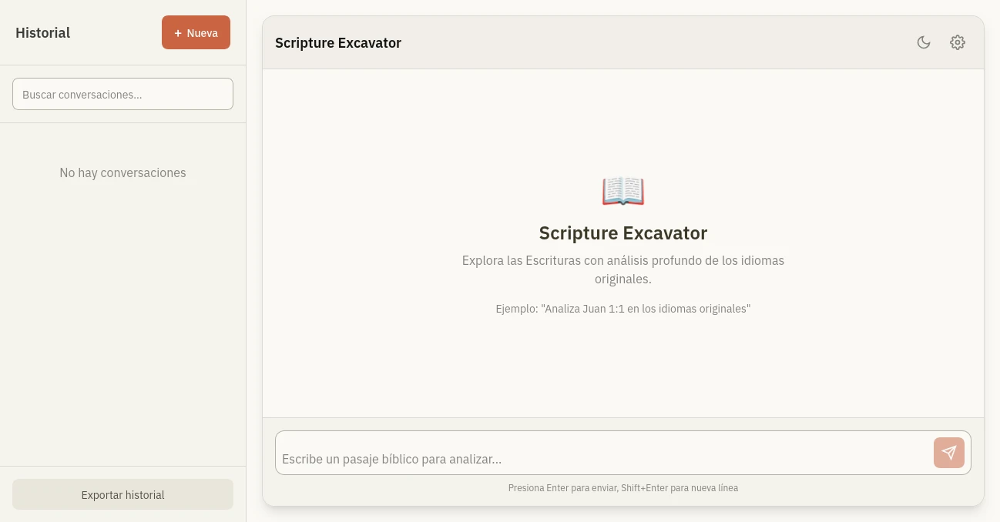

# Scripture Excavator

A Bible study assistant application built with Vue 3 and Vite. This app helps users study biblical passages by providing access to multiple Bible versions and integrating with AI models for analysis and insights.



## Features

- **100% Browser-Based**: Works entirely in the browser without requiring server-side processing.
- **Chat Interface**: Allows users to study biblical passages through interactive conversations.
- **Multiple Bible Versions**: Supports various Bible translations including Aramaic, Greek, Hebrew, and Spanish versions.
- **AI Integration**: Uses AI models to analyze and provide insights on biblical passages.
- **Chat History**: Maintains a history of conversations for easy reference.
- **Customizable Settings**: Allows users to configure API keys and model parameters.
- **Streaming Responses**: Displays AI responses in real-time with Markdown formatting.
- **Bible Downloads**: Downloads and stores Bible files in IndexedDB for offline access.

## Technologies Used

- **Vue 3**: Progressive JavaScript framework for building user interfaces.
- **Vite**: Fast build tool and development server.
- **Tailwind CSS**: Utility-first CSS framework for styling.
- **IndexedDB**: Browser-based database for storing Bible files.
- **AI Models**: Integration with AI models like `deepseek-ai/DeepSeek-V3.2-TEE` and `openai/gpt-oss-120b-TEE`.

## Installation

1. Clone the repository:
   ```bash
   git clone https://github.com/yourusername/scripture-excavator.git
   ```

2. Navigate to the project directory:
   ```bash
   cd scripture-excavator
   ```

3. Install dependencies:
   ```bash
   npm install
   ```

4. Start the development server:
   ```bash
   npm run dev
   ```

## Usage

1. **Set Up API Key**: Configure your API key in the settings panel.
2. **Download Bibles**: The app will prompt you to download the necessary Bible files on first launch.
3. **Start a Conversation**: Begin a chat session to study biblical passages.
4. **Explore Passages**: Use the AI to analyze and gain insights into specific verses or chapters.

## Project Structure

- `src/`: Contains the main application code.
  - `components/`: Vue components for the UI.
  - `composables/`: Reusable logic and state management.
  - `stores/`: Pinia stores for state management.
  - `utils/`: Utility functions and tools.
- `resources/`: Contains Bible files and other resources.
- `docs/`: Documentation and preview images.


## Preview


